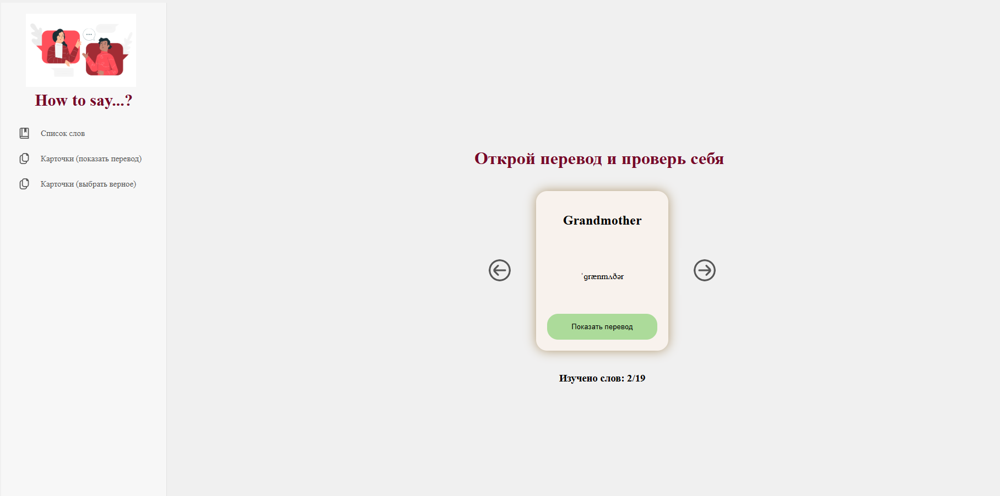
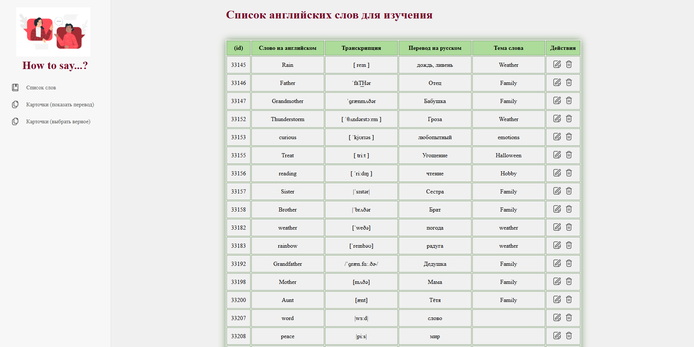

# app_for_learning_eng. React

Приложение для изучения иностранных слов по карточкам.

Технологии:
HTML, CSS, JS, React

Постановка задачи:

1. список всех существующих слов
2. у каждого слова должно быть:

- основное значение, транскрипция, перевод, тема
- возможность удаления и редактирования

3. должна быть возможность добавления новых слов
4. карточка слова с отображением: основное значение, транскрипция, перевод, тема
5. главная страница, где отображаются списки слов и карточек

# week22

1. создать новый проект и набросать структуру приложения (список компонент — jsx файлы).
2. cоздай основные компоненты для приложения:

- хедер, футер, карточку слов
- и любые другие компоненты, которые ты хочешь использовать.

# week23

Стилизовать элемент из прошлой недели:

1. Подключи стили для всех созданных элементов.
2. Выдели основные цвета, шрифты и размеры в отдельный файл.
3. Добавь анимацию наведения, фокуса и нажатия на все элементы взаимодействия с пользователем (кнопки, формы и т.д.).
4. Сделай список слов в виде таблицы.
5. Реализуй условный рендеринг для полей таблицы:

- должны отображаться либо поля для чтения и с кнопками редактировать/удалить,
- либо поля ввода с кнопками сохранить/отмена.

# week24

Добавить:

1. карточке слова добавь состояние, которое будет отвечать за показывание/скрытие перевода. По умолчанию перевод всегда скрыт. При нажатии на кнопку «Показать перевод», появляется перевод слова, а кнопка исчезает. Реализуй этот функционал с помощью внутреннего состояния элемента и условного рендеринга;
2. +-в таблицах добавь состояние для открытия/закрытия режима редактирования;
3. у всех редактируемых полей изначальное состояние должно получаться из props. Добавь обработчики событий изменения этих полей;
4. добавь обработчику события кнопку «отмена редактирования». При нажатии этой кнопки, редактирование закрывается, все поля должны быть возвращены к изначальному значению.

# week25

Создай новый компонент, который будет получать через props массив слов и показывать их по одному как раз с помощью компонента-карточки. Также добавь две кнопки-стрелки, по клику на которые карточка будет меняться на следующую или предыдущую.

Детали задания:

1. родительскому компоненту для карточек слов нужно добавить состояние, в котором будет храниться индекс карточки. У любого состояния есть начальное значение. Напиши код таким образом, чтобы его можно было взять из prop. А если prop не передан, то показывай первую карточку из массива;
2. далее нужно добавить методы для перелистывания карточек вперед-назад. Повесить на кнопки соответствующие обработчики событий;
3. нужно продумать момент: что произойдет, когда карточки закончились? Например, можно снова показать первую карточку или вывести сообщение для пользователя;
4. в дальнейшем слова будут браться при запросе на сервер. Продумай момент, как будет вести себя ваше приложение, если массив не передали. Возможно, тебе пригодятся свойства по умолчанию (defaultProps);
5. стилизуй новый компонент. Не забывай об эффектах для наведения, фокуса и клика.

# week26

Задание для проекта:

1. добавить в приложение компонент меню с логотипом (любым) и ссылками на Главную страницу и Страницу с карточками. Меню должно быть стилизовано и всегда находиться в верхней части приложения (не уезжать при прокрутке). При клике на логотип приложение должно возвращаться на главную страницу;
2. на главной странице должна располагаться наша созданная таблица слов;
3. на странице с карточками (/game) должен быть компонент с нашим тренажером для изучения слов по карточкам;
4. перепишите компонент таблицы слов с использованием метода map() (если ещё этого не сделали).

# week27

Задание для проекта:

1. в родительском компоненте для карточек слов добавь состояние: оно должно отображать, сколько слов изучено за одну тренировку. Состояние должно увеличиваться на 1 каждый раз, когда человек нажимает кнопку «посмотреть перевод» в дочернем компоненте карточки слова;
2. в компоненте карточки слова автоматически устанавливать фокус на кнопке «посмотреть перевод» как только новая карточка отрендерилась на странице

# week28

Задание для проекта:

1. в таблицах слов добавь проверку на пустые поля при изменении содержимого. Если хотя бы одно поле осталось пустым, кнопка Сохранить должна быть заблокирована, а пустое поле (или несколько) должно быть обведено красной рамкой;
2. реализуй метод сохранения изменений в новом слове. Мы пока не будем делать запрос на сервер, но при нажатии на кнопку Сохранить должна проходить проверка: если хотя бы одно поле в строке содержит ошибки, то нужно уведомить пользователя, что произошла ошибка. Если все поля соответствуют требованиям, выведи в консоль сообщение с параметрами формы и закройте режим редактирования.
3. в компоненте карточки слова попробуй реализовать автоматическую установку фокуса на кнопке «посмотреть перевод» как только новая карточка отрендерилась на странице.
